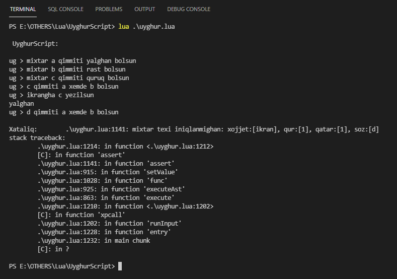
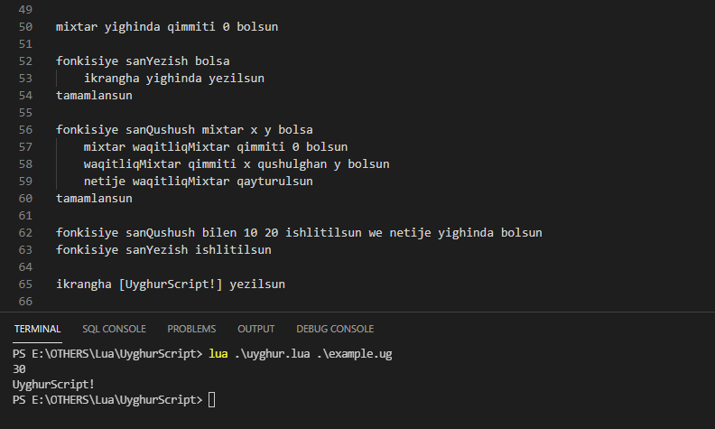

# UyghurScript

## 0. description

> a toy script interpreter writen in lua, u can learn how to write an interpreter by reading this repo ...

## 1. data types and variable declaration

```python

# only chars are supported for variable name, and all the variables are global
mixtar mixtarName qimmiti 0 bolsun

# string
mixtar a qimmiti [Salam Uyghur Script!] bolsun

# number
mixtar b qimmiti 1 bolsun

# bool (rast, yalghan)
mixtar c qimmiti rast bolsun

# nil
mixtar d qimmiti quruq bolsun

# assign a value
c qimmiti yalghan bolsun

# transform data type (number & string)
qimmet b tipi san bolsun
qimmet b tipi xet bolsun

```

## 2. operations

```python

# concat strings
a qimmiti [hi! ] ulanghan a bolsun

# calculate numbers (qushulghan, elinghan, kupeytilgen, bulungen)
b qimmiti a kupeytilghen 10 bolsun

# logic operations (kichik, chong, teng)
c qimmiti a kichik 5 bolsun

# logic operations (hemde, yaki, ekische)
c qimmiti c hemde yalghan bolsun

```

## 3. io

```python

# output
ikrangha [Ana Tilim Zer Tilim!] yezilsun

# input
ikrandin a oqulsun
a qimmiti [mezmun:] ulanghan a bolsun
ikrangha a yezilsun

```

## 4. if

```python

mixtar a qimmiti quruq bolsun
mixtar b qimmiti quruq bolsun
mixtar c qimmiti quruq bolsun

# eger (variable) qimmiti (variable|string|number|bool|nil) bolsa
eger a qimmiti rast bolsa
    ikrangha [eger] yezilsun
egerde b qimmiti rast bolsa
    ikrangha [egerde1] yezilsun
egerde c qimmiti rast bolsa
    ikrangha [egerde2] yezilsun
bolmisa
    ikrangha [bolmisa] yezilsun
tamamlansun

```

## 5. while

```python

# u can write an if statement in it
mixtar d qimmiti 0 bolsun
# nawada (variable) qimmiti (variable|string|number|bool|nil) bolsa
nawada c qimmiti rast bolsa
    d qimmiti d qushulghan 1 bolsun
    ikrangha d yezilsun
    c qimmiti d kichik 5 bolsun
tamamlansun

```

## 6. functions

```python

# variable
mixtar yighinda qimmiti 0 bolsun

# function without args and return
fonkisiye sanYezish bolsa
    ikrangha yighinda yezilsun
tamamlansun

# function with variables and return
fonkisiye sanQushush mixtar x y bolsa
    mixtar waqitliqMixtar qimmiti 0 bolsun
    waqitliqMixtar qimmiti x qushulghan y bolsun
    netije waqitliqMixtar qayturulsun
tamamlansun

# call with variables and receive result
fonkisiye sanQushush bilen 10 20 ishlitilsun we netije yighinda bolsun

# call without variable, and not result 
fonkisiye sanYezish ishlitilsun

# parse from a string
mixtar isim qimmiti [Yezish] bolsun
qimmet isim tipi fonkisiye bolsun
fonkisiye isim ishlitilsun

```

## 7. usage

* fist of all, u need to download [lua binary](http://luabinaries.sourceforge.net/) to run this program
* run the command `lua uyghur.lua` for a REPL
* run the command `lua uyghur.lua example.ug false` to execute your script
* run the command `lua uyghur.lua example.ug true` to compile your script to lua
* or import as a module and call the module functions in a lua script like this:

```lua
-- import module
local uyghur = require("uyghur")

-- version code
print(uyghur.version)

-- register a lua func to uyghur script
uyghur.import("chongniTepish", "math.max")

-- register a uyghur func to lua script
uyghur.export("sanQushush", "addNumber")

-- execute a uyghur script
uyghur.execute("example.ug")

-- compile a uyghur script (there will be an output file named example.ug.lua in the same directory)
uyghur.compile("example.ug")

-- run a REPL in console
uyghur.run()

```

## 8. call lua func in uyghur

```lua
-- require uyghur script as a mudle and import the lua function before execute your script
local uyghur = require("uyghur")
uyghur.import("chongniTepish", "math.max")
uyghur.execute("example.ug")
```

```python
# then u can call the lua func by nickname in uyghur script as a ordinary uyghur func
mixtar chongSan qimmiti quruq bolsun
fonkisiye chongniTepish bilen 10 20 ishlitilsun we netije chongSan bolsun
ikrangha chongSan yezilsun
```

## 9. call uyghur func in lua

```python
# declare a uyghur func in script file
fonkisiye sanQushush mixtar x y bolsa
    mixtar waqitliqMixtar qimmiti 0 bolsun
    waqitliqMixtar qimmiti x qushulghan y bolsun
    netije waqitliqMixtar qayturulsun
tamamlansun
```

```lua
-- require uyghur script as a mudle and export the uyghur function before execute your script
local uyghur = require("uyghur")
uyghur.export("sanQushush", "myMath.addNumber")
uyghur.execute("example.ug")
local result = myMath.addNumber(11, 22)
print("result of uyghur func sanQushush is:", result)
```

## 10. example





## 11. todo

* list
* map

## 12. end

> tokenizer and parserhave been implemented in this repo, and i am still working on executer ...
